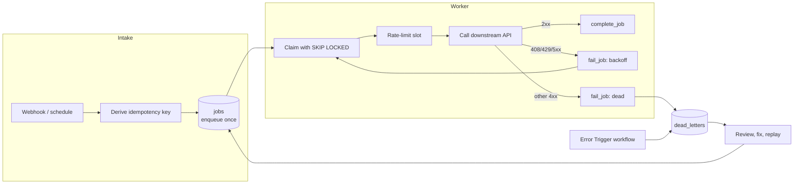

# n8n Production Resilience Patterns

Practical patterns for n8n workflows that have to keep working when APIs time out, models return malformed output, executions crash halfway, and the same event arrives twice.

This repository pairs short explanations with importable workflows, a PostgreSQL schema that holds workflow state, and a local Docker stack with a deterministic mock API, so every pattern can be run and broken on purpose before you rely on it.

Created and maintained by Hira Ahmed.

## Why this exists

A workflow that works in the editor can still fail in production in ways the editor never shows:

- A downstream API returns 503 for a minute, and every item in the run is lost.
- A retry sends the same email or creates the same record twice.
- An execution dies after claiming work, and that work is never picked up again.
- A model returns prose instead of JSON, and a parser throws in the middle of a batch.
- A failure lands in the execution log, which is pruned a week later, and nobody finds out.

None of these are exotic. They come from treating a workflow run as the only place state lives. The patterns here move state into PostgreSQL, make every failure end somewhere visible, and make repeated execution safe.

## Patterns

| Pattern | Problem it addresses | Guide | Example | Origin |
|---|---|---|---|---|
| Retry with exponential backoff | Transient API failures | [retries-and-backoff](docs/patterns/retries-and-backoff.md) | [retry/](examples/retry/) | New demonstration |
| Global error handler | Failures that stop a workflow silently | [error-trigger](docs/patterns/error-trigger.md) | [error-trigger/](examples/error-trigger/) | New demonstration |
| PostgreSQL dead-letter queue | Failed work disappearing | [dead-letter-queue](docs/patterns/dead-letter-queue.md) | [dlq/](examples/dlq/), [guardrail](examples/state-machine/guardrail-delta-gate.json) | Derived from my workflows |
| Idempotency | Duplicate side effects from retries and redelivery | [idempotency](docs/patterns/idempotency.md) | [idempotency/](examples/idempotency/) | New demonstration |
| Shared rate limiting | Several executions exceeding one API budget | [rate-limiting](docs/patterns/rate-limiting.md) | [rate-limiting/](examples/rate-limiting/) | New demonstration |
| Safe replay | Re-running failed work without making things worse | [replay](docs/patterns/replay.md) | [replay/](examples/replay/) | Both (see below) |
| Explicit state and job lifecycle | Work lost when an execution crashes | [explicit-state](docs/patterns/explicit-state.md) | [state-machine/](examples/state-machine/) | Both (see below) |
| Delta-gated alerts | Alert fatigue from repeated notifications | [explicit-state](docs/patterns/explicit-state.md#delta-gated-transitions) | [guardrail](examples/state-machine/guardrail-delta-gate.json) | Derived from my workflows |
| Defensive LLM output parsing | Malformed model output breaking a batch | [ai-output-validation](docs/patterns/ai-output-validation.md) | [ai-output-validation/](examples/ai-output-validation/) | Derived from my workflows |
| Human approval before irreversible actions | AI-drafted actions sent without review | [human-approval-gate](docs/patterns/human-approval-gate.md) | Pattern guide only | Derived from my workflows |

Also: [architecture overview](docs/architecture/overview.md), [failure scenarios](docs/failure-scenarios.md), [observability](docs/patterns/observability.md), [troubleshooting](docs/troubleshooting/README.md), [limitations and tradeoffs](docs/limitations-and-tradeoffs.md), [security](docs/security.md), [self-hosted deployment](docs/deployment/self-hosted-docker.md).

### Real patterns versus demonstrations

Every example says where it came from, in its sticky note and in [examples/README.md](examples/README.md).

- **Derived from my existing work:** reduced, sanitized versions of patterns from workflows I built, including my [Financial Profitability Guardrail](https://github.com/hira299/Financial-Profitability-Guardrail), [Competitor Intelligence & SEO pipeline](https://github.com/hira299/Autonomous-Competitor-Intelligence-SEO-Pipeline), and the DLQ replay workflow of my [cloud security audit platform](https://github.com/hira299/Cloud-Security-Audit-Compliance-Automation-Platform). External services are replaced with the mock API, and where I would now do something differently, the example says so.
- **New demonstrations:** written for this repository to show a pattern in isolation. They run and are tested, but they are teaching examples, not code lifted from a production system.

No private workflows, client logic, prompts, or credentials are published here.

## Architecture at a glance



Workflows never update tables directly. They call a small set of SQL functions (`enqueue_job`, `claim_jobs`, `complete_job`, `fail_job`, `replay_dead_letters`, and so on) defined in [sql/schema.sql](sql/schema.sql). Keeping the state rules in the database means they are atomic, testable with plain SQL, and identical for every workflow that uses them.

## Quick start

Requirements: Docker with Compose v2.

```bash
git clone https://github.com/hira299/n8n-production-resilience-patterns.git
cd n8n-production-resilience-patterns/docker
cp .env.example .env
# edit .env: set POSTGRES_PASSWORD and N8N_ENCRYPTION_KEY (openssl rand -hex 32)
docker compose up -d
```

Then:

1. Open http://localhost:5678 and create the owner account.
2. Create a **Postgres** credential: host `postgres`, database `resilience`, user and password from `.env`, SSL disabled.
3. Import workflows from `examples/` (Workflows, Import from File). Import `error-trigger/global-error-handler.json` first, because other examples reference it by ID.
4. Open each imported workflow, select your Postgres credential on its Postgres nodes, and follow the sticky note.
5. Publish the global error handler. In n8n 2.x an unpublished error workflow does not run.

The stack publishes n8n and Postgres on 127.0.0.1 only. The mock API is reachable from n8n at `http://mock-api:8080` and is not exposed to the host.

To use the schema in your own database instead: `psql "$DATABASE_URL" -f sql/schema.sql`. It creates everything in a `resilience` schema and is safe to run more than once.

## Repository layout

```
docs/          pattern guides, architecture, failure scenarios, troubleshooting, deployment, security
examples/      importable workflows, one folder per pattern
sql/           the shared PostgreSQL schema and functions
docker/        compose stack, database init, deterministic mock API
diagrams/      Mermaid sources for the diagrams in the docs
tests/         SQL behavior tests, a concurrency test, and an end-to-end run in real n8n
```

## Validation

- `tests/sql/test_schema.sql`: behavior tests for every state-transition function (idempotent enqueue, fenced completion, backoff bounds, dead-lettering, replay guards, rate-limit ceiling, delta gate).
- `tests/sql/test_concurrent_claims.sh`: parallel workers claim from one queue; checks that no job is claimed twice.
- `tests/e2e/e2e.py`: starts an isolated copy of the stack, imports every example into n8n, runs them, and asserts on database rows and mock API counters.

The end-to-end run was last executed against n8n 2.10.3 and PostgreSQL 16. Node parameters can change between n8n versions; see [tests/README.md](tests/README.md).

## Limitations

These patterns reduce specific failure modes. They do not make a workflow correct, and none of them removes the need to understand the systems you call. Delivery is at-least-once, so downstream idempotency still matters; a Postgres-backed queue is a fit for moderate volumes, not a replacement for a message broker at high throughput; fixed-window rate limiting allows bursts at window edges. Details and alternatives are in [limitations-and-tradeoffs](docs/limitations-and-tradeoffs.md).

## Contributing

Issues and pull requests are welcome, especially failure cases these patterns do not handle. See [CONTRIBUTING.md](CONTRIBUTING.md).

## License

[MIT](LICENSE)

## About the author

Hira Ahmed, AI Engineer and AI Automation & QA Engineer. I build AI automation, n8n workflows, and LLM pipelines, and test systems at their failure boundaries.

[Portfolio](https://hira299.github.io/) · [GitHub](https://github.com/hira299) · [LinkedIn](https://www.linkedin.com/in/hira-ahmed-4068402a7) · [Upwork](https://www.upwork.com/freelancers/~0178616a4e00b82166) · [Fiverr](https://www.fiverr.com/hira299)
