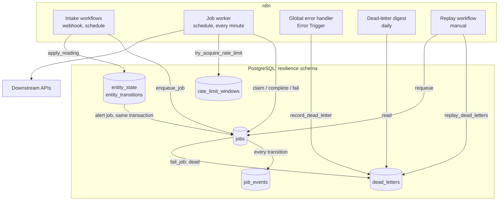
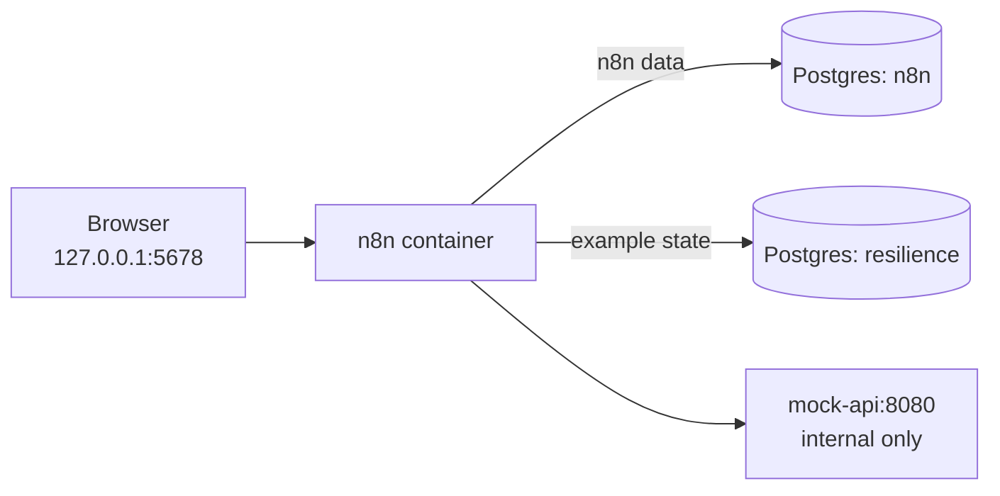

# Architecture overview

The patterns share one idea: **the workflow run is disposable; the state is not.** Workflows read and change state only through SQL functions, so any execution can crash, restart, or run twice without losing track of what has been done.

## Components

## Responsibilities

| Component | Owns | Does not own |
|---|---|---|
| Intake workflow | validating input, deriving the idempotency key, enqueueing | calling downstream APIs |
| Job worker | claiming, calling APIs, classifying outcomes | deciding what the next state is (SQL does) |
| SQL functions | allowed transitions, locking, backoff, dead-lettering | business logic of the job itself |
| Error handler | recording unexpected failures of any workflow | retrying them |
| Replay workflow | selecting what to replay after a fix | fixing the cause |

Keeping intake and processing separate is what makes the intake fast and idempotent: a webhook responds as soon as the job is stored, and the sender's retries only ever hit `enqueue_job()`.

## Failure boundaries

Each boundary is a place where a failure is contained instead of spreading:

1. **Per item.** Error outputs and "never error" HTTP settings turn a failed item into data, so one bad item does not stop the batch.
2. **Per job.** Each job completes or fails in its own transaction (`queryBatching: independently` on the Postgres nodes).
3. **Per execution.** A crashed execution leaves claimed jobs with an expiring lock; `reclaim_stale_jobs()` recovers them.
4. **Per workflow.** Unexpected failures go through the Error Trigger to the dead-letter table.
5. **Per dependency.** Rate limits and backoff keep one struggling API from consuming the whole retry budget.

See [failure scenarios](../failure-scenarios.md) for what happens at each crash point.

## Local stack

One Postgres server holds two databases: `n8n` for n8n's own data, and `resilience` for the example schema. In production you may prefer separate servers, so that heavy workflow state cannot slow down n8n itself.
