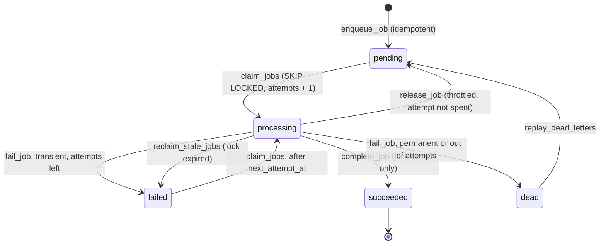

# Explicit workflow state

## The failure

A scheduled workflow fetches 500 records, processes them one by one, and crashes at record 312. The next run starts from the beginning, or from "since last run", and either redoes 311 records or skips 188. Nobody can say which records are done, because "done" only existed inside the execution that died.

This is the root cause behind most of the other failures in this repository: treating the execution as the place where progress lives.

## The pattern

Give every unit of work a row with an explicit status, and let workflows move it between statuses through functions that enforce the allowed transitions. The execution becomes disposable: any run can pick up where the last one stopped, because where it stopped is in the database.

## Job lifecycle

What each part buys you:

- **`pending` with an idempotency key:** the same work cannot be enqueued twice.
- **`processing` with `locked_by` and `locked_at`:** you can see what is in flight and who owns it. `FOR UPDATE SKIP LOCKED` lets several executions or queue-mode workers claim concurrently without taking the same job; the concurrency test runs 8 parallel claimers against 200 jobs and checks that each job is claimed once.
- **`failed` with `next_attempt_at`:** retries are durable and spaced by backoff, and they survive restarts.
- **`dead`:** a terminal failure, mirrored in the dead-letter queue.
- **Lock timeout:** `reclaim_stale_jobs()` returns jobs whose worker vanished. Without it, a crash mid-job leaves that job in `processing` forever.
- **`job_events`:** every transition, with attempt numbers and errors, for debugging and metrics.

The [job worker](../../examples/state-machine/job-worker.json) is the consumer: recover stale jobs, claim a batch, call the API, classify, and complete or fail each job. It is the same approach I described for the queue worker in my Cloud Compliance engine (row-level locks so two workers never take the same item, paced calls, exponential backoff on failure), rebuilt here on a shared schema.

### Choosing the lock timeout

Set it well above the longest time a job can legitimately take, including the HTTP timeout and any waits. Too short, and a slow job is reclaimed while still running, so the work happens twice (fencing rejects the late completion, but not the side effect). Too long, and a crashed job waits that long to be retried.

## Delta-gated transitions

The second use of explicit state is deciding when something is worth acting on.

My [Financial Profitability Guardrail](https://github.com/hira299/Financial-Profitability-Guardrail) monitors project budgets on a schedule. Each project is HEALTHY, WARNING (80% of budget used), or CRITICAL (100%). The naive version alerts every time a project is over threshold, which means the same alert every 15 minutes until people stop reading them. The guardrail stores each project's last state in Postgres and alerts only on a transition into a non-healthy state. A project that stays CRITICAL alerts once; a project with no stored state starts as NEW.

The [guardrail example](../../examples/state-machine/guardrail-delta-gate.json) is a reduced version of that workflow, with the task source replaced by the mock API. One thing is deliberately different from the original: there, the state upsert and the alert gate ran in parallel from the delta node, so an alert could go out even if saving the new state failed, and the next run would alert again. In the example, state is saved first and the gate runs after it.

Even with that fix, the code-based version reads state in one step and writes it in another. Two overlapping executions can both read WARNING, both compute CRITICAL, and both alert. The [SQL delta gate](../../examples/state-machine/sql-delta-gate.json) closes that gap. `apply_reading()` locks the entity row, compares, writes the new state, logs the transition, and, for a transition into WARNING or CRITICAL, enqueues an alert job, all in one transaction. The alert is delivered by the job worker with retries and dead-lettering. If the transaction rolls back, neither the state change nor the alert exists. This is the transactional outbox pattern.

| | Code-node version | SQL version |
|---|---|---|
| Logic lives in | n8n Code nodes, easy to read and change | a Postgres function |
| Concurrent runs | can double-alert | serialized per entity |
| Alert delivery | inline HTTP call, failure to DLQ | outbox job with retries, backoff, DLQ |
| Good for | one scheduled workflow, low stakes | several producers, alerts that must not be lost |

## Tradeoffs

- A Postgres-backed queue is simple to run and easy to inspect, and it is a reasonable fit up to a moderate number of jobs per second. Beyond that, polling and row locking become a bottleneck, and a broker (SQS, RabbitMQ, or n8n queue mode with Redis for execution distribution) is the better tool.
- Delivery is at-least-once. Explicit state makes duplicates rare and visible; it does not make them impossible.
- More state means more to maintain: retention for `jobs` and `job_events`, indexes, and migrations when the schema changes.
