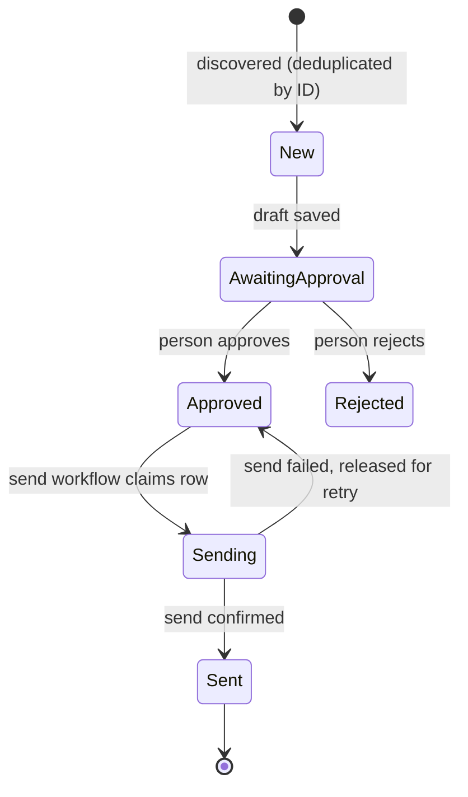

# Human approval before irreversible actions

## The failure

An AI step drafts something that leaves your system (an email to a real person, a message to a customer, a change to a live record) and the workflow sends it directly. A wrong name, an invented detail, or an off tone goes out, and it cannot be taken back.

## Where this comes from

I built a small set of n8n workflows for my own job-search outreach. They are personal and not published here, but their structure is a clean example of this pattern:

1. **Discover:** a scheduled workflow collects listings from public job-board APIs, deduplicates them by ID, and adds new ones with status `New`.
2. **Draft:** a second workflow picks up `New` rows, has an LLM draft an email from a fixed list of verified facts, saves the draft, sets the status to `Awaiting Approval`, and notifies me.
3. **Approve:** I read the draft and set the status to `Approved` by hand, or edit it first.
4. **Send:** a third workflow sends only `Approved` rows and marks them `Sent`.
5. **Monitor replies:** a fourth workflow classifies replies and emails me a suggested response. It never replies on its own.

The workflows never talk to each other directly. The status column is the contract between them, and the only way from draft to sent goes through a person.

## The state machine



`Sending` is not in my original workflows. It is the fix for a gap they had (see below).

## What went wrong, and what to copy

Two real bugs from these workflows are worth knowing about, because both are easy to introduce:

- **The state filter disappeared in an edit.** One revision of the drafting workflow lost its `status = New` filter, so every run would redraft every row, including ones already approved or sent. The filter is the whole pipeline's correctness, and it is one field in one node.
- **The upsert matched on the wrong column.** A revision of the discovery workflow matched rows on `status` instead of `job_id`. Matching on a mutable field means unrelated rows overwrite each other. Upserts must match on a stable identity.

And one design gap: the send workflow sent the email, then marked the row `Sent`. A failure in between leaves the row `Approved`, so the next run sends the email again. The fix is to claim before acting:

```sql
-- claim: only rows still Approved, and only one worker gets each
UPDATE outreach
SET status = 'Sending', claimed_at = now()
WHERE id IN (
  SELECT id FROM outreach WHERE status = 'Approved'
  ORDER BY approved_at LIMIT 10 FOR UPDATE SKIP LOCKED
)
RETURNING *;

-- after the send succeeds
UPDATE outreach SET status = 'Sent', sent_at = now() WHERE id = $1 AND status = 'Sending';

-- sweep: rows stuck in Sending need a person to check whether the send happened
SELECT * FROM outreach WHERE status = 'Sending' AND claimed_at < now() - interval '30 minutes';
```

For email, a row stuck in `Sending` is ambiguous: the message may or may not have gone out. That is the honest answer, and it belongs in front of a person, not in an automatic retry.

A spreadsheet works as the state store for a personal tool like this, but it has no transactions or row locks, so claiming is not atomic there. When more than one execution can touch the same rows, move the state to a database.

## When to use an approval gate

- the action is irreversible or externally visible
- the content is generated, not templated
- the volume is low enough for a person to review, or you can sample

Approval shifts responsibility; it does not remove it. Make the review easy (show the draft and the facts it used side by side) or it becomes a rubber stamp.
